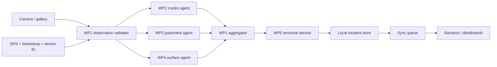

# TariqMap Hybrid Architecture

## Decision

Use Flutter for the phone application and Python for model preparation. The phone must work without network access during inspection. Network synchronization is a separate concern and must never block capture or inference.

## Runtime pipeline



The three agent calls run independently. If one model fails, the observation is retained with the successful outputs and an explicit agent error. No silent failure is allowed.

## Model bundles

Each model is packaged with a manifest:

```json
{
  "bundleVersion": "2026.09.0",
  "agent": "cracks",
  "format": "onnx",
  "inputSize": 640,
  "classes": ["D00", "D10"],
  "normalization": "0..1 RGB",
  "nmsIou": 0.45,
  "confidence": 0.35
}
```

The production bundle should contain the model, manifest, checksum, and model card. Prefer an int8 quantized student model after accuracy verification. Keep a float16 fallback for devices where int8 delegates are unavailable.

## Metadata and privacy

Capture metadata is not expected from RDD2024. WP1 creates it at runtime. GPS permission is requested only when the user starts an inspection. Images remain in app-private storage until the user or a synchronization policy uploads them. Do not infer exact physical depth from a 2D image.

## Priority

The client uses a transparent baseline score for triage only. A future backend may refine it using road class, confidence, defect severity, recurrence, and proximity to critical assets. The score is not an automatic decision and must remain editable or reviewable by the responsible actor.

## Backend boundary

The future backend should expose:

- `POST /observations` for batched observations and detections.
- `GET /roads/match?lat=&lon=` for route, segment, and owner.
- `PATCH /incidents/{id}` for status and intervention updates.
- `GET /analytics` for actor-specific aggregates.

The client currently uses a local territorial service so that the product flow is testable before the SIG data source is selected.
