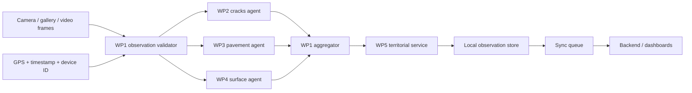

# TariqMap Hybrid Architecture

## Decision

Use Flutter for the phone application and Python for model preparation. The phone must work without network access during inspection. Network synchronization is a separate concern and must never block capture or inference.

Week 1 was specification-only. Treat SIG, RAG, and incident dashboards as **PLANNED** unless a row in [traceability.md](traceability.md) says otherwise.

## Work packages → folders

```
WP1 Acquisition & Orchestration
  app/lib/screens/home_screen.dart          still image
  app/lib/screens/camera_detection_screen.dart
  app/lib/screens/video_import_screen.dart  frames, never MP4→detector
  app/lib/services/video_frame_extractor.dart
  app/lib/services/detection_service.dart   routes to three agents
  training/src/process_video.py             desktop mux

WP2 Agent Fissures (D00, D10)
  training/config/cracks.yaml
  app TFLite runner agent=cracks

WP3 Agent Chaussée PRIORITY (D20, D40) — visual 2D, no depth
  training/config/pavement.yaml
  training/src/train.py --agent pavement
  training/src/distill.py (KD stub)
  app TFLite runner agent=pavement

WP4 Agent Marquage & Surface (D50, D60, D90)
  training/config/surface.yaml
  app TFLite runner agent=surface

WP5 SIG, attribution, incidents, decision
  app/lib/services/territorial_service.dart stub (unmatched)
  app/lib/models/incident.dart              lifecycle constants
  backend/lifecycle.py + mock FastAPI
  RAG: PLANNED, decision-support only
```

Training may convert a unified RDD dump (`training/config/rdd_unified.yaml`) and then **split** it (`prepare_dataset.py`). Deployment must keep three runners. Do not ship one 7-class YOLO.

## Runtime pipeline



The three agent calls run independently. If one model fails, the observation is retained with the successful outputs and an explicit agent error. No silent failure is allowed.

If GPS is missing, WP1 still commits the observation (`gpsAvailable: false`, lat/lon 0). WP5 must not drop it. Territorial match stays `unmatched` until enrichment. Do not invent an institutional owner from latitude (actors are peers).

## Domain model (UML)

Specified entities: Image, Observation, Detection, Defect, Report, GPSCoordinate, Road, RoadSegment, Territory, Incident, Intervention, User, Actor, Recommendation.

Implemented now: Image (file path), Observation, Detection, Actor (selection), GPS fields on Observation, Incident **status constants only**.

Detection fields: `detectionId` (derived `stableId` until the runner stamps a UUID), `classId`, `confidence`, `bbox`, `detectedAt`.

Incident lifecycle (validated): `DETECTED → ANALYZED → ASSIGNED → IN_PROGRESS → RESOLVED → ARCHIVED`. Persistence and operator UI for that machine are PLANNED.

## Model bundles

Each model is packaged with a manifest. Runtime NMS/confidence are also user-configurable in Settings (`InferenceConfig`); they default to the contract below and do **not** change letterbox geometry.

```json
{
  "bundleVersion": "2026.09.0",
  "agent": "pavement",
  "format": "tflite",
  "inputSize": 640,
  "classes": ["D20", "D40"],
  "normalization": "0..1 RGB",
  "nmsIou": 0.45,
  "confidence": 0.35
}
```

Validated ML path: **baseline (YOLOv8n, WP3 first) → teacher → knowledge distillation (`src.distill`) → student → quantization (float16 then int8) → TFLite deploy**. Prefer an int8 quantized student after accuracy verification. Keep a float16 fallback for devices where int8 delegates are unavailable. KD cannot run until teacher weights exist; the stub writes `metrics: null`.

## Metadata and privacy

Capture metadata is not expected from RDD2024. WP1 creates it at runtime. GPS permission is requested only when the user starts an inspection. Images remain in app-private storage until the user or a synchronization policy uploads them. Do not infer exact physical depth from a 2D image.

## Actors and decisions

Municipalité, Ministère de l'Équipement, and Tunisie Autoroutes are **equal** platform actors. Geographic scope does not imply UI or workflow hierarchy.

The client uses a transparent baseline score for triage only. A future backend may refine it using road class, confidence, defect severity, recurrence, and proximity to critical assets. **RAG is decision support only**; the responsible actor decides. The score is not an automatic decision.

## Backend boundary

The future backend should expose:

- `POST /observations` for batched observations and detections (**IMPLEMENTED** as an in-memory demo).
- `GET /v1/contract` for actor and incident-status constants (**IMPLEMENTED**, read-only).
- `GET /roads/match?lat=&lon=` for route, segment, and owner (**PLANNED**).
- `PATCH /incidents/{id}` for status and intervention updates (**PLANNED**).
- `GET /analytics` for actor-specific aggregates (**PLANNED**; mock `/v1/stats` exists).

The client currently uses a local territorial stub so the capture flow is testable before the SIG data source is selected.
